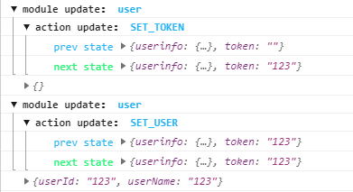

# store-hook

一种基于对象定义与 hooks 范式的简易数据管理方案 `思考`，通常用于中台项目的全局共享数据。

##  定义

定义位于 `type.ts`文件

## 使用

### index.ts

```ts
import { isProd } from '@/utils/is';
import loggerPlugin from './plugins/logger';
import persistPlugin from './plugins/persist';
import { Store } from './type';

const createStore = Store({
  plugins: [persistPlugin('mybugStore'), isProd ? undefined : loggerPlugin]
});

export default createStore;

```

### user.ts

```ts
import createModule from '..';

export type UserInfo = {
  userID: string;
  userName: string;
};
export type UserState = {
  userinfo: UserInfo;
  token: string;
};

const useUserStore = createModule({
  namespace: 'user',
  state: {
    userinfo: {} as UserInfo,
    token: ''
  },
  SET_USER(payload: UserInfo) {
    console.log(this.state.userinfo);
    this.setState({ userinfo: payload });
    console.log(this.state.userinfo);
  },
  SET_TOKEN(token: string) {
    this.setState({ token });
  },
  logout(search: string) {
    this.SET_USER({} as UserInfo);
    this.SET_TOKEN('');
    window.location.href = `/login?redirect=${search}`;
  }
});
export default useUserStore;


```

### 运行结果


